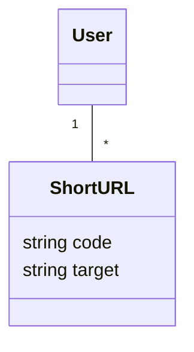
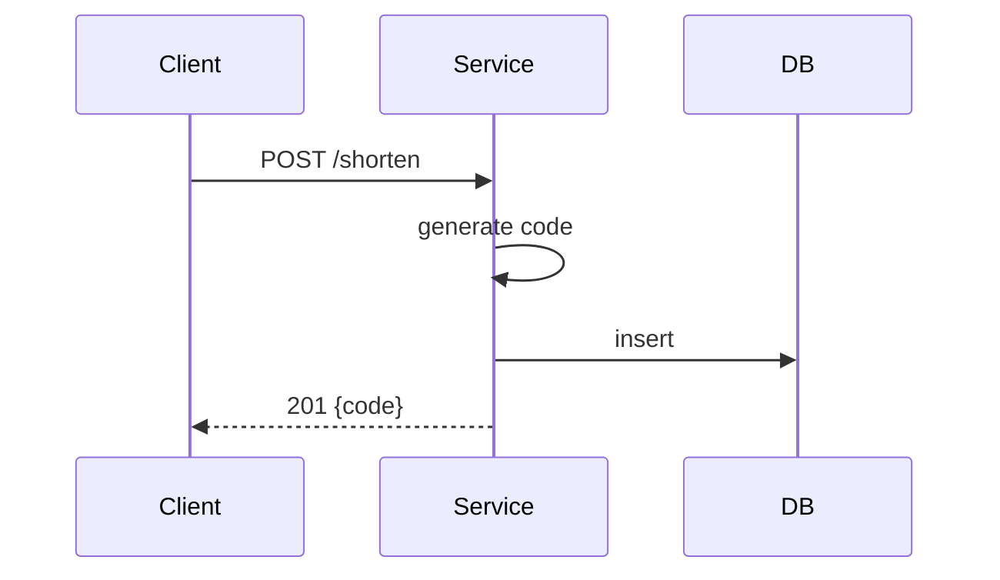

# Interview Prep Skill for abstractinterviews.github.io

## Purpose
This skill defines a clear, repeatable command an LLM agent can follow to enrich the `abstractinterviews.github.io` Jekyll site with interview-prep content covering: LLD, HLD, Coding Interview, Architecture, Design Patterns, and System Design Concepts.

## When to run
- Creating new interview-prep posts or series
- Converting existing articles into interview-prep format
- Auditing site content for missing sections or diagrams

## Top-level command name
`/skill:interview-prep` — invoke with a single argument describing the target (new-post, audit, convert, scaffold). Example:

    /skill:interview-prep new-post "Design a URL shortener"

## Inputs the LLM should accept
- `action`: one of `new-post`, `scaffold`, `audit`, `convert`
- `title`: human-friendly title (for new-post/scaffold/convert)
- `slug` (optional): URL-friendly slug; default: generated from title
- `audience`: `beginner` | `intermediate` | `advanced` (affects depth)
- `focus`: one or more of `LLD`, `HLD`, `Coding`, `Architecture`, `Patterns`, `SystemDesign`
- `languages`: preferred implementation languages, e.g. `python, java, cpp`

## Output contract
The LLM must produce:
- A Markdown file placed under `_posts/` or `interview/` following the site's conventions.
- Valid Jekyll frontmatter with these required keys: `title`, `date`, `slug`, `categories`, `difficulty`, `reading_time`, `tags`, `layout`.
- The body must include the required section structure for the requested `focus` (see Templates).
- At least one Mermaid diagram for sequence/component/architecture explanations.
- For `Coding` focus: one runnable code snippet with example input/output and complexity analysis.
- A short practice quiz (3–5 questions) with answers hidden (use HTML comment or collapsible block).

## File naming and frontmatter defaults
- File name: `YYYY-MM-DD-<slug>.md` placed in `_posts/` or `interview/`.
- Default `layout`: `post` or `interview` if the theme provides it.
- `categories`: include `interview-prep` and one or more of `l l d`, `h l d`, `coding`, `architecture`, `patterns`, `system-design` as appropriate.

## Templates

LLD (Low-Level Design) template
- Frontmatter
  ```yaml
  title: "<Title>"
  date: <YYYY-MM-DD>
  slug: <slug>
  categories: [interview-prep, lld]
  difficulty: intermediate
  reading_time: 10
  tags: [classes, design, diagram]
  layout: interview
  ```
- Sections (in order):
  - Problem statement
  - Requirements (functional + non-functional)
  - Domain model (text + Mermaid class diagram)
  - Component responsibilities (short bullets)
  - Sequence diagrams (Mermaid) for main flows
  - Data structures & storage choices
  - API contract (if applicable)
  - Tests & edge cases
  - Summary & tradeoffs

HLD (High-Level Design) template
- Sections:
  - Problem statement & context
  - Goals & constraints
  - Proposed architecture (Mermaid C4-style/component diagram)
  - Data flow & scaling strategy
  - Availability, consistency, partitioning discussion
  - Operational considerations (monitoring, DR, costs)
  - Tradeoffs & alternatives

Coding Interview template
- Sections:
  - Problem statement and examples
  - Constraints & expected input sizes
  - Approach summary (brief)
  - Pseudocode
  - Reference implementations (at least one language)
  - Complexity analysis
  - Unit tests / sample runs
  - Hints & follow-ups (optimization ideas)

Architecture / Design Patterns / System Design Concepts
- Sections:
  - Concept definition
  - When to use (real-world examples)
  - Anti-patterns and pitfalls
  - Example implementation or diagram (Mermaid)
  - Related patterns and tradeoffs

## Agent behavior rules and checks (must follow)
1. Validate frontmatter keys exist and are well-formed.
2. Ensure at least one Mermaid diagram is present for LLD/HLD/Architecture posts.
3. For `Coding` posts, ensure code compiles (where feasible) or at least is syntactically correct for the requested language.
4. Keep the post modular: include short, copyable code blocks, and clearly labeled diagram blocks.
5. Add a 3–5 question practice quiz at the end. Provide answers in a hidden section (comment or collapsible) and a short explanation for each.

## Example invocation patterns (LLM prompts)
- Create new LLD post: `/skill:interview-prep new-post "Design a URL shortener" --focus=LLD --audience=intermediate --languages=java`
- Scaffold conversion: `/skill:interview-prep convert "existing-file.md" --focus=Coding --languages=python`
- Audit site: `/skill:interview-prep audit --report=missing-diagrams.md`

## Audit output for `audit` action
- The audit must produce a small Markdown report listing:
  - Files missing required frontmatter keys
  - Posts missing Mermaid diagrams when expected
  - Coding posts without runnable code snippets or examples

## Suggested quick validation commands (agent may run locally)
- Check for frontmatter keys (bash):
  ```bash
  grep -R "^title:\|^date:\|^slug:\|^categories:\|^difficulty:" _posts/ || true
  ```
- Find posts missing Mermaid blocks:
  ```bash
  grep -R "mermaid\|graph TD\|sequenceDiagram" _posts/ || true
  ```

## Good practices for generated content
- Favor small focused posts (one core idea per post).
- Include code examples with small test harnesses.
- Always explain tradeoffs and complexity.
- Use consistent Mermaid theme/style for diagrams.

## Safety, licenses and attribution
- Never fabricate real company-specific private architecture or proprietary source code. If referencing real systems, use high-level anonymized descriptions.
- When using third-party code snippets or diagrams, add attribution in a short `References` section.

## Example minimal LLD post (generated body sketch)
---
Frontmatter as above
---

### Problem statement
Short, precise.

### Requirements
- Functional: ...
- Non-functional: availability, latency

### Domain model


### Sequence (create)


### Tests and edge cases
- Collision handling
- Rate limits

### Quiz
1. Question?
<!-- Answers: 1) ... -->

## Extensibility notes for implementers
- The skill can be expanded to scaffold sample code files (e.g., `solutions/<slug>/solution.py`) and CI tests.
- If the site later adds a plugin that enforces frontmatter, update this skill's validation section accordingly.

---
This SKILL.md is intended as a precise, actionable contract an LLM agent can follow when authoring or auditing interview-prep content on the Jekyll site.
