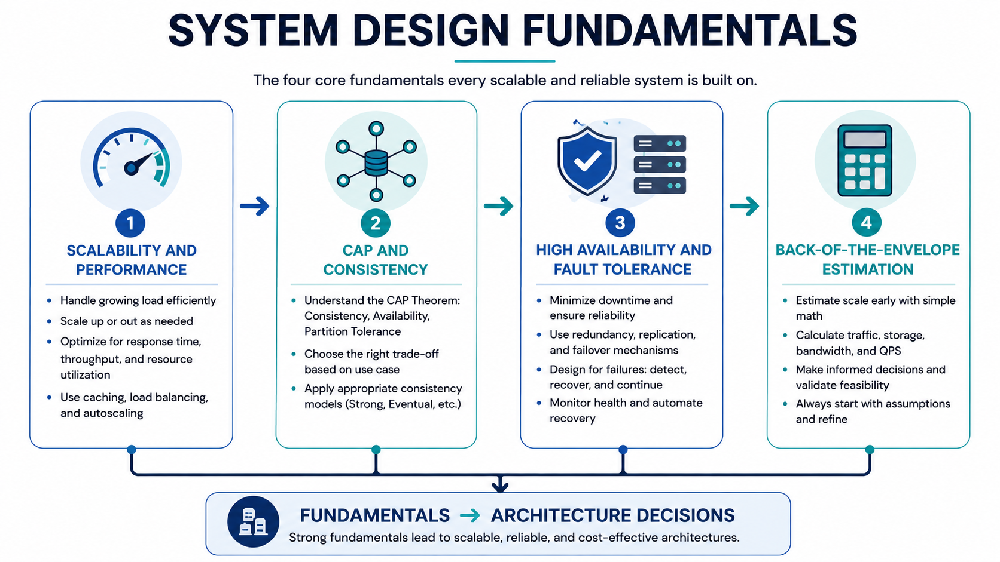

# Fundamentals

This section builds the base mental models needed for every system design interview.

## Topics

- [Scalability and Performance](./scalability.md)
- [CAP Theorem and Consistency Models](./cap-theorem.md)
- [High Availability and Fault Tolerance](./high-availability.md)
- [Back-of-the-Envelope Estimation](./estimation.md)

*Figure 1: System Design Fundamentals Map*

## How to Use

1. Read in the order listed above.
2. Practice explaining each topic in 2 minutes.
3. For each case study, explicitly call out which fundamental trade-offs are in play.

## Interview Checklist

- Define workload shape (read-heavy, write-heavy, bursty).
- State latency and availability targets.
- Identify consistency requirements by operation.
- Mention failure modes and recovery strategy.
- Validate design capacity with quick estimates.
