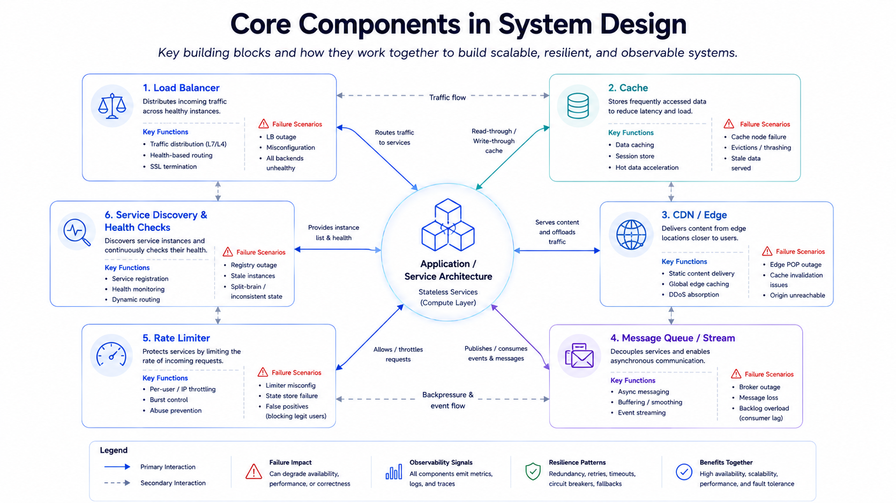

# Core Components

This section covers reusable infrastructure building blocks that appear in most system design interviews.

## Topics

- [Load Balancers](./load-balancers.md)
- [Caching Strategies](./caching.md)
- [CDN and Edge Computing](./cdn.md)
- [Message Queues and Event Streaming](./message-queues.md)
- [Rate Limiting](./rate-limiting.md)
- [Service Discovery and Health Checks](./service-discovery.md)

## How to Study

1. Learn when each component is needed.
2. Learn failure modes for each component.
3. Practice combining two or three components into one design story.

## Interview Checklist

- Explain why the component exists in your design.
- Mention at least one trade-off and one failure scenario.
- Describe observability and operational safeguards.
