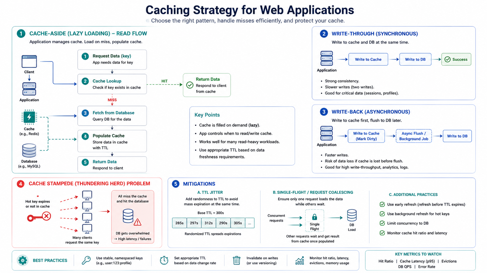

# Caching Strategies

Caching reduces latency and backend load by serving frequently requested data from fast storage.

## 1. When to Cache

Use caching when:

- Data is read frequently
- Backend calls are expensive
- Slight staleness is acceptable for some paths

Avoid caching blindly for strongly consistent write-critical paths unless correctness is preserved.

## 2. Cache Placement

- Client cache (browser/mobile)
- CDN/edge cache
- Reverse proxy cache
- Application cache (Redis/Memcached)
- Database page cache

Most systems use multiple layers.

## 3. Core Strategies

*Figure 1: Caching Strategies for Web Applications*

## Cache-aside (lazy loading)

1. Read cache.
2. On miss, read database.
3. Populate cache.

Pros: simple and widely used.

## Read-through

Application reads from cache service that fetches source on miss.

Pros: centralizes cache logic.

## Write-through

Writes go to cache and backing store synchronously.

Pros: fresh cache after write.
Cons: higher write latency.

## Write-back (write-behind)

Write to cache first, persist later asynchronously.

Pros: fast writes.
Cons: risk of data loss on failure.

## 4. Invalidation and TTL

There are two hard things in distributed systems: cache invalidation and naming.

Practical tools:

- TTL-based expiration
- Explicit key invalidation on writes
- Versioned keys
- Event-driven invalidation

## 5. Eviction Policies

- LRU (least recently used)
- LFU (least frequently used)
- FIFO
- TTL-expired eviction

Choose policy based on access patterns.

## 6. Cache Failure Scenarios

- Thundering herd on mass expiration
- Cache stampede on hot-key miss
- Hot keys causing uneven shard load
- Stale data due to missed invalidation

Mitigations:

- Jittered TTLs
- Request coalescing/single-flight
- Hot-key replication
- Circuit breakers and graceful fallback

## 7. Interview Framing

1. Define what data is cached and for how long.
2. Explain invalidation strategy.
3. Explain consistency impact.
4. Explain failure behavior when cache is down.
5. Mention hit ratio, miss penalty, and p99 goals.
