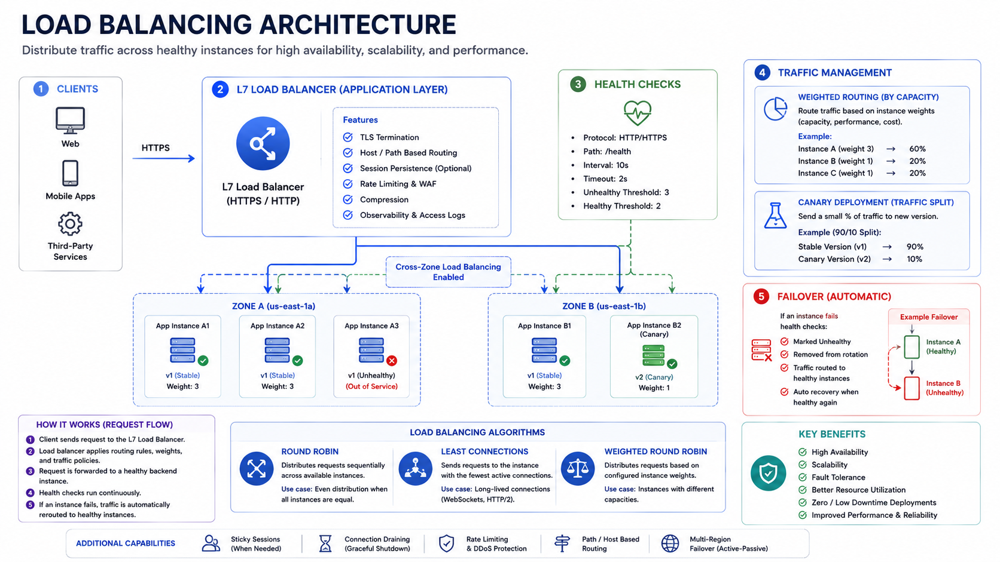

# Load Balancers

Load balancers distribute traffic across backend instances to improve availability, utilization, and scalability.

## 1. Why Load Balancers Matter

- Remove single-server bottlenecks
- Improve resilience by routing around unhealthy nodes
- Enable horizontal scaling
- Support zero-downtime deployments

## 2. L4 vs L7

## Layer 4 (transport level)

- Routes based on IP and port
- Fast and simple
- Limited request-aware routing

## Layer 7 (application level)

- Routes by URL path, host, headers, cookies
- Supports advanced policies: auth, canary, sticky sessions
- More CPU overhead than L4

*Figure 1: Load Balancing Architecture*

## 3. Common Routing Algorithms

- Round robin
- Weighted round robin
- Least connections
- Least response time
- Hash-based (for stickiness)

Choose based on workload and session behavior.

## 4. Health Checks

Load balancers rely on health checks to avoid unhealthy instances.

- Liveness checks: process is up
- Readiness checks: instance can serve traffic
- Deep checks: dependency-aware checks (use sparingly)

## 5. Session Affinity

Sticky sessions route a user to the same backend instance.

Pros:

- Useful for legacy stateful apps

Cons:

- Uneven load distribution
- Harder failover behavior
- Reduced elasticity

Prefer stateless services with shared session stores when possible.

## 6. Deployment Patterns

- Blue/green
- Canary
- Rolling updates

All require safe health checks, metrics-based rollback, and gradual traffic shifting.

## 7. Failure Modes

- Misconfigured health checks causing mass eviction
- Overloaded balancer tier
- Imbalanced distribution due to stickiness
- TLS termination bottlenecks

## 8. Interview Framing

1. Decide L4 or L7 for the use case.
2. State routing algorithm and why.
3. Explain health-check design.
4. Explain deployment and rollback safety.
5. Mention observability: error rate, backend saturation, tail latency.

