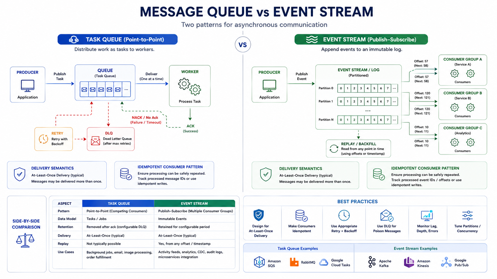

# Message Queues and Event Streaming

Queues and streams decouple services, absorb spikes, and enable asynchronous processing.

## 1. Queue vs Stream

*Figure 1: Message Queue vs Event Stream*

## Message queue

- Work-distribution model
- Consumer processes and acknowledges message
- Often used for background jobs and task execution

## Event stream

- Append-only log model
- Multiple consumers can read independently
- Often used for event-driven architectures and analytics

## 2. Why Use Them

- Smooth traffic spikes
- Isolate slow downstream dependencies
- Improve system modularity
- Enable retries and failure recovery
- Support fan-out to multiple consumers

## 3. Delivery Semantics

- At-most-once: may lose messages, no duplicates
- At-least-once: no loss preferred, duplicates possible
- Exactly-once: strongest semantics, highest complexity

Most practical systems use at-least-once plus idempotent consumers.

## 4. Ordering Guarantees

- Global ordering is expensive and often unnecessary.
- Partition-level ordering is common and practical.
- Use a stable partition key for entity-level ordering.

## 5. Retry and Dead Letter Strategy

1. Retry transient failures with backoff and jitter.
2. Cap retry attempts.
3. Send poison messages to dead-letter queue.
4. Provide replay tooling for recovery.

## 6. Consumer Design Rules

- Make handlers idempotent.
- Keep processing bounded and observable.
- Commit offsets/acks only after successful processing.
- Support safe reprocessing.

## 7. Backpressure

Use queue length and processing lag to trigger scaling and admission control.

Important metrics:

- Consumer lag
- Oldest message age
- Retry volume
- Dead-letter rate

## 8. Interview Framing

1. Explain why async is needed.
2. Choose queue or stream model.
3. Define delivery and ordering requirements.
4. Explain retry, DLQ, and replay model.
5. Explain consumer idempotency.

