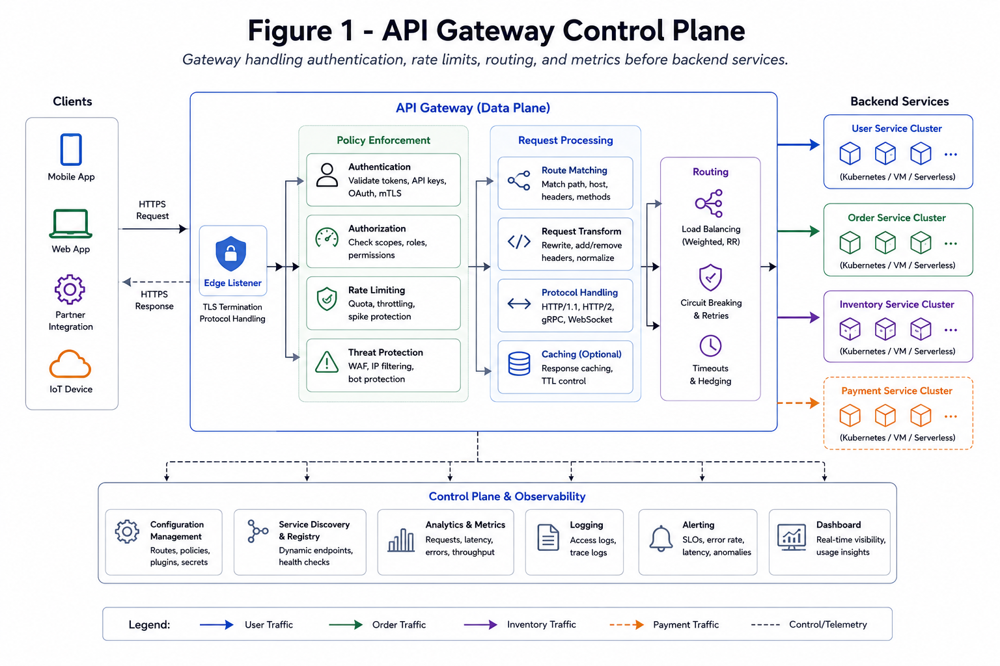

# API Gateway

API gateway is the policy edge for auth, routing, throttling, and observability.

*Figure 1: Gateway handling authentication, rate limits, routing, and metrics before backend services.*

## Responsibilities

- Authentication/authorization
- Request validation
- Rate limiting and quotas
- TLS termination and routing
- Response shaping and headers

## Failure Design

- Fail-open vs fail-closed policy per endpoint
- Timeout budgets and circuit breaking
- Global error shape and tracing IDs
