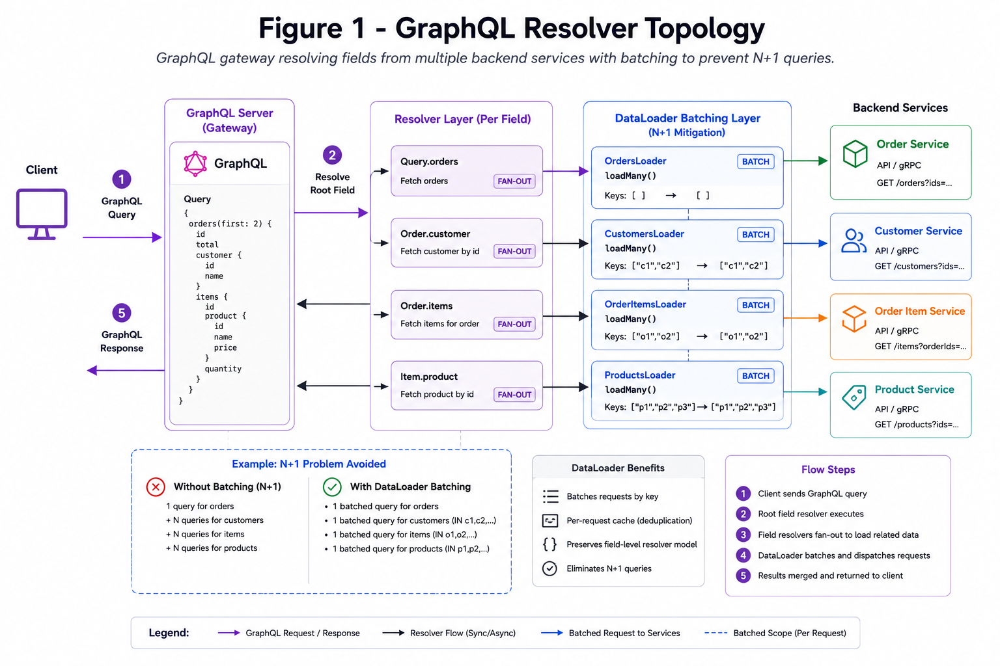
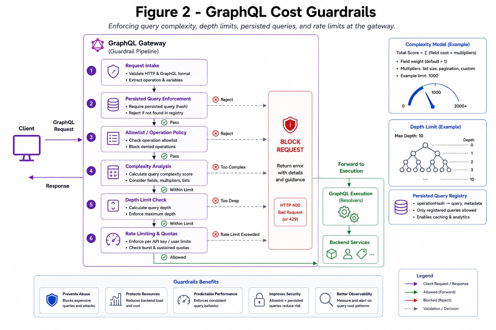

# GraphQL

GraphQL enables client-driven querying and schema-typed APIs.

*Figure 1: GraphQL gateway resolving fields from multiple backend services with batching.*

## Strengths

- Reduces over-fetch and under-fetch
- One endpoint for many client shapes
- Strong schema introspection

## Risks

- Expensive nested queries
- Resolver fan-out latency
- Caching complexity by query shape

*Figure 2: Query complexity analysis with depth limits and persisted query enforcement.*

