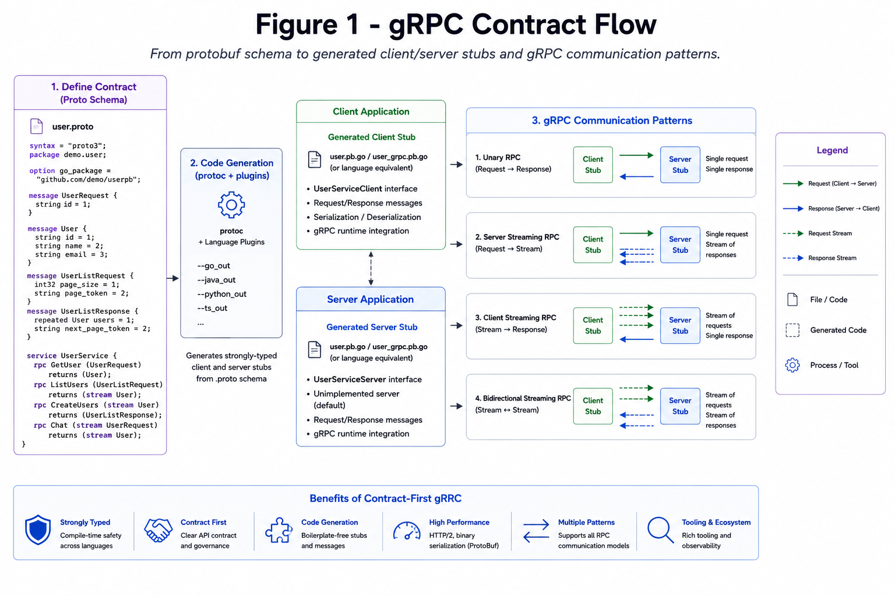

# gRPC and Protobuf

gRPC is strongly typed RPC over HTTP/2 using Protobuf contracts.

*Figure 1: Client and server generated stubs from protobuf schema with unary and streaming calls.*

## When It Fits

- Low-latency internal service calls
- Strong contracts across teams
- Streaming use cases

## Trade-Offs

- Browser support needs gateway/proxy
- Harder to debug manually than JSON REST
- Contract versioning discipline required
