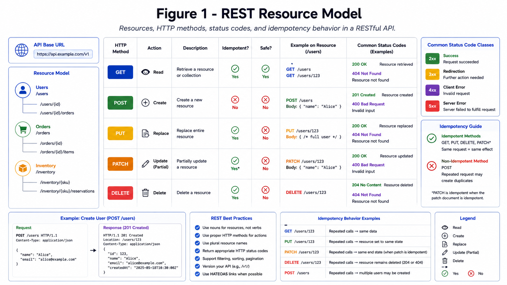

# REST API Design

REST is resource-oriented HTTP communication with predictable semantics and cache friendliness.

*Figure 1: REST design showing resources, HTTP verbs, status codes, and idempotency behavior.*

## Key Rules

- Use nouns for resources.
- Keep methods semantic.
- Return consistent status/error shapes.
- Support pagination and filtering.

## Reliability Practices

- Idempotency keys for mutation retries.
- Timeouts and retry policy by endpoint type.
- Versioning strategy (URI or header based).

*Figure 2: Request retry flow with idempotency keys and safe duplicate handling.*
