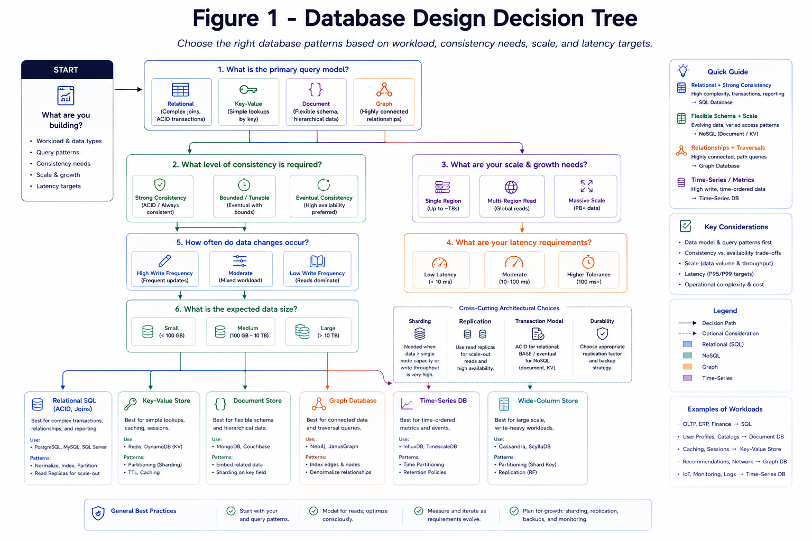

# Databases

This section covers data store decisions and distributed storage trade-offs.

*Figure 1: Decision tree from workload and consistency requirements to SQL/NoSQL, sharding, replication, and transaction model.*

## Topics

- [SQL vs NoSQL](./sql-vs-nosql.md)
- [Sharding Strategies](./sharding.md)
- [Replication and Failover](./replication.md)
- [Schema Design and Evolution](./schema-design.md)
- [Distributed Transactions](./distributed-transactions.md)
- [Time-Series and Specialized Stores](./specialized-stores.md)
