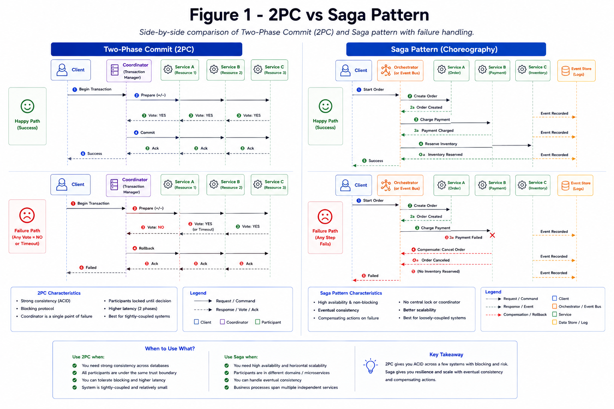

# Distributed Transactions

Distributed writes across services need consistency patterns beyond a single DB transaction.

*Figure 1: Comparison of two-phase commit coordinator flow and saga compensation workflow.*

## Options

- 2PC for strict cross-resource atomicity (high coupling).
- Saga for eventual consistency with compensations.
- Outbox pattern for reliable event publishing.
