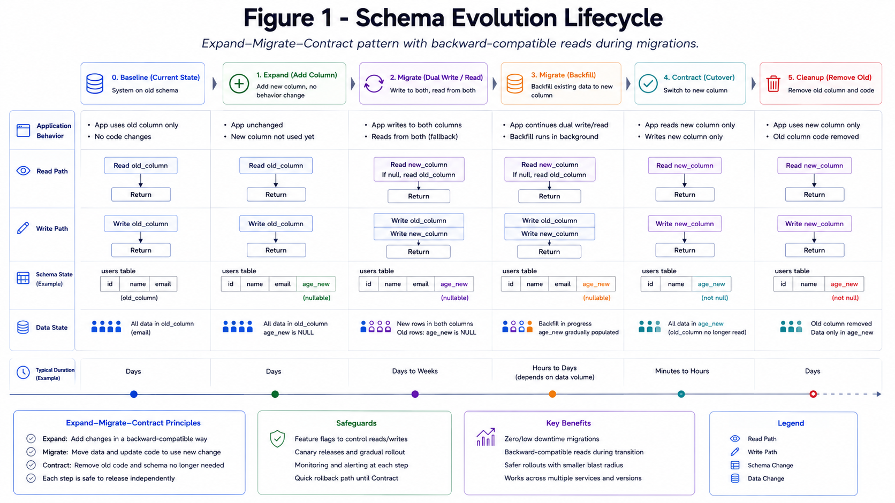

# Schema Design and Evolution

Schema should optimize hot queries while preserving future change safety.

*Figure 1: Expand-migrate-contract rollout pattern with backward-compatible reads during migrations.*

## Good Practices

- Version data contracts.
- Use additive migrations first.
- Avoid destructive schema changes during peak traffic.
