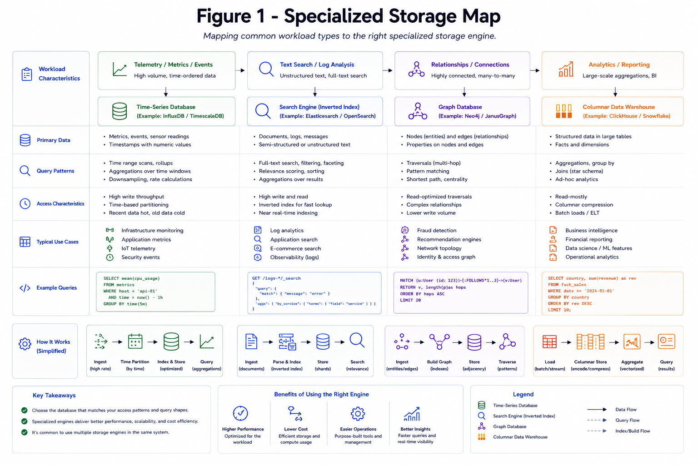

# Time-Series and Specialized Stores

Specialized databases optimize specific workloads better than general-purpose stores.

*Figure 1: Mapping of workload types to time-series, search, graph, and columnar stores.*

## Common Fits

- Metrics/logs: time-series DB
- Full-text queries: search engine
- Relationship-heavy traversals: graph DB
- OLAP analytics: columnar warehouse
