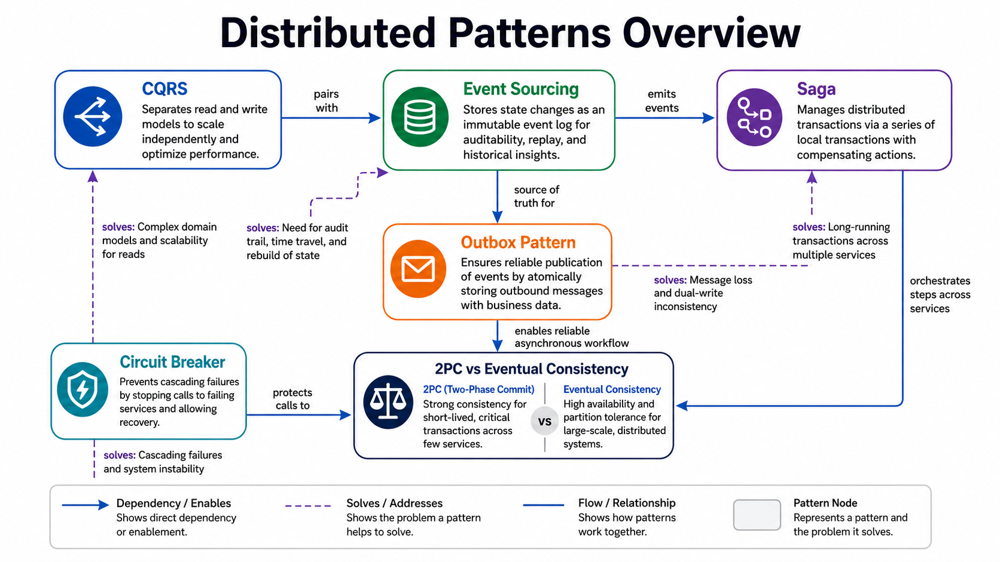

# Patterns

This section covers commonly used distributed-system patterns and where they fit.

*Figure 1: Pattern map connecting CQRS, event sourcing, saga, circuit breaker, outbox, and consistency models.*

## Topics

- [CQRS](./cqrs.md)
- [Event Sourcing](./event-sourcing.md)
- [Saga Pattern](./saga.md)
- [Circuit Breaker and Bulkhead](./circuit-breaker.md)
- [Outbox Pattern](./outbox.md)
- [2PC vs Eventual Consistency](./2pc-vs-eventual.md)
