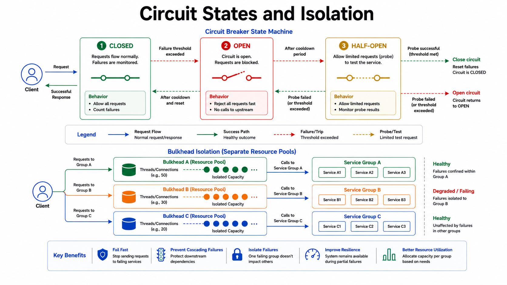

# Circuit Breaker and Bulkhead

Circuit breaker prevents repeated calls to failing dependencies; bulkhead isolates failures between pools.

*Figure 1: Closed-open-half-open circuit transitions with separate resource pools for bulkhead isolation.*

This reduces cascading failures and latency blowups during partial outages.

