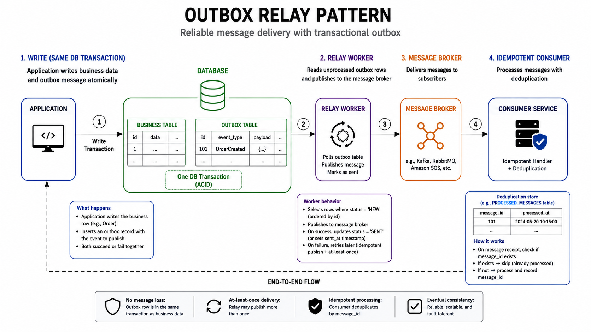

# Outbox Pattern

Outbox ensures DB state changes and event publication are reliably linked.

*Figure 1: Transaction writes business row and outbox row, relay publishes to broker, consumer processes idempotently.*

Essential for reliable event-driven integration without dual-write race conditions.
