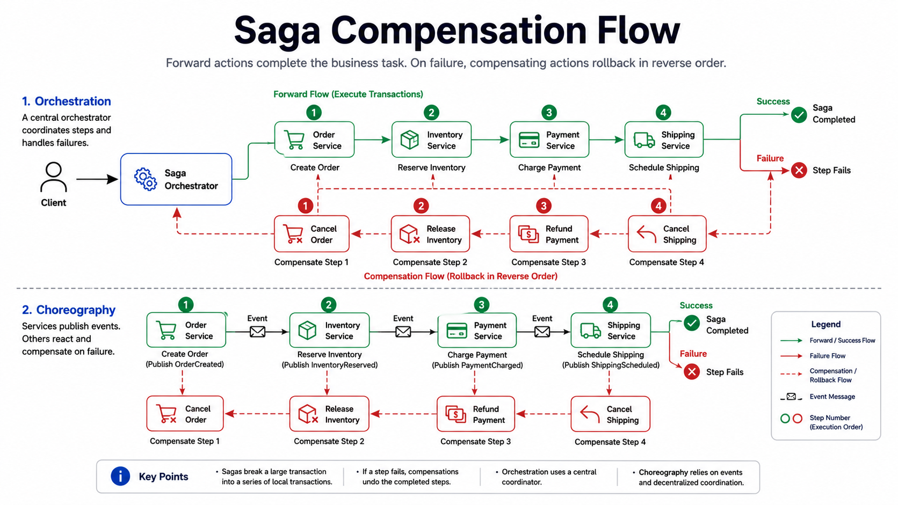

# Saga Pattern

Saga coordinates multi-step distributed workflows with compensation on failure.

*Figure 1: Multi-service transaction steps with rollback compensation when a step fails.*

Use when strict global transaction is impractical across microservices.

