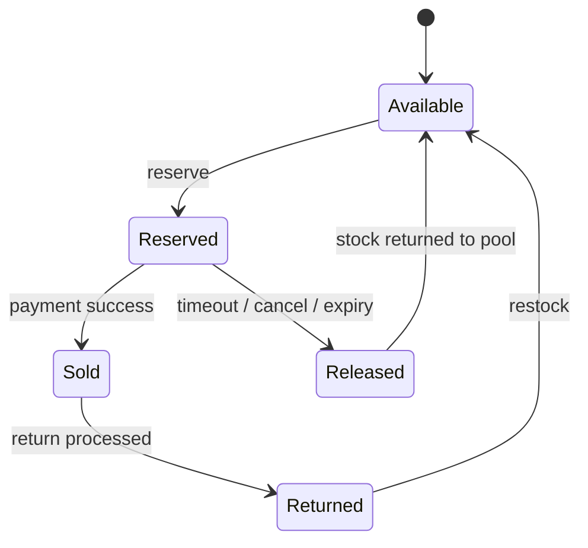

# E-Commerce Inventory Management System

This case study shows how to design inventory for a large e-commerce platform that must sell exact stock, prevent overselling, and stay available during flash sales.

The two diagrams in this folder cover the full system and the overselling deep dive:

- [High-level design](./high-level-design.png)
- [Overselling deep dive](./deep-dive-overselling.png)

## 1. Problem Statement

The system must answer a simple but hard question: how do we let millions of users buy the same SKU without ever selling more units than we physically have?

At small scale, a simple database update is enough. At real-world scale, we need reservations, expiry, inventory commits, auditability, and support for multiple warehouses.

## 2. Functional Requirements

- View real-time inventory by SKU and location
- Reserve inventory when an item is added to cart or checkout starts
- Commit inventory after payment succeeds
- Release expired reservations automatically
- Support multi-warehouse allocation
- Handle returns and restocking
- Produce accurate inventory data for reporting
- Audit every inventory state change

## 3. Non-Functional Requirements

- No overselling
- High availability, ideally 99.99%
- Very low latency for inventory lookups
- High throughput during flash sales
- Strong consistency for stock updates
- Eventual consistency for downstream projections and analytics
- Horizontal scalability
- Fault tolerance and recovery from partial failures

## 4. Core Entities

- Product: the sellable SKU
- Inventory: quantity by SKU and warehouse
- Reservation: temporary hold with TTL
- Order: payment and fulfillment intent
- Warehouse: physical stock location
- Stock movement: immutable event for every change
- Return: stock added back after a return

## 5. High-Level Design

```text
Create a detailed architecture poster for "E-Commerce Inventory Management System". Include API gateway, cart/checkout, inventory reservation service, warehouse allocation, Redis for atomic holds, inventory ledger DB, event bus, and analytics/audit consumers. Emphasize overselling prevention with reservation TTL and commit/release flow. Style: enterprise system diagram, clear labels, white background, blue/green/orange accents, 16:9.
```

The high-level flow is:

1. The customer calls the API gateway from web or mobile.
2. Product, cart, and order services coordinate the buying journey.
3. The inventory service owns stock state and reservation logic.
4. A reservation engine performs atomic holds.
5. Allocation logic chooses one or more warehouses.
6. A projection service serves read-optimized inventory views.
7. Kafka or another event bus propagates inventory events to downstream systems.
8. Audit, analytics, and warehouse sync systems consume the same events.

### Main APIs

```text
GET  /inventory/sku/{sku}
GET  /inventory/sku/{sku}/locations
POST /inventory/reserve
POST /inventory/release
POST /inventory/commit
POST /orders
GET  /orders/{orderId}
POST /returns
GET  /returns/{returnId}
```

## 6. Inventory State Model

Inventory should move through a small number of explicit states:



The important idea is that reservation is not a sale. A reservation is only a temporary hold that becomes a sale after payment succeeds.

## 7. Deep Dive: Preventing Overselling

```text
Create a deep-dive sequence diagram for "Preventing Overselling" in e-commerce. Show customer, checkout service, inventory reservation service, Redis/atomic store, payment service, and background expiry worker. Include steps: reserve, TTL hold, payment success commit, payment failure release, expiration release. Highlight race-condition prevention and idempotency. Style: technical sequence diagram, crisp labels, white background, blue and orange accents, 16:9.
```

The overselling problem happens when multiple users read the same available stock and then all try to buy it at the same time.

### Naive approach that fails

If two users read `stock = 1` and both decrement later, the database may end up at `-1`. That is exactly the failure the deep-dive diagram demonstrates.

### Correct flow

1. The user clicks Buy Now.
2. The checkout service asks inventory to reserve the stock.
3. Inventory performs an atomic check-and-reserve operation.
4. If enough stock exists, the system creates a reservation record with a TTL.
5. The order proceeds to payment.
6. If payment succeeds, the reservation is committed to sold.
7. If payment fails or times out, the reservation is released.
8. A background worker expires stale holds and returns the stock to available.

### Reservation rules

- A reservation must be atomic.
- A reservation must have a timeout.
- A reservation must be uniquely identified.
- A commit must only succeed for an active reservation.
- A release must be idempotent.

## 8. Key Algorithms

### Reserve inventory

1. Read the current available quantity for the SKU or SKU-location pair.
2. If quantity is insufficient, reject immediately.
3. Atomically decrement available stock.
4. Create a reservation record with expiry metadata.
5. Publish an inventory-reserved event.

### Commit inventory

1. Verify that the reservation still exists and is active.
2. Mark the reservation as sold/committed.
3. Publish an inventory-committed event.
4. Keep the inventory ledger immutable so the sale can be audited later.

### Release inventory

1. Verify that the reservation is still releasable.
2. Mark the reservation as released or expired.
3. Atomically add the quantity back to available stock.
4. Publish an inventory-released event.

## 9. Data Stores

- Redis cluster for low-latency atomic stock operations and reservation tracking
- Inventory ledger database for immutable source-of-truth events
- Warehouse database for stock by warehouse and bin level
- Read cache for denormalized inventory views
- Kafka or an event bus for inventory change propagation
- Data warehouse for reporting and analytics
- Audit database for compliance logs

The practical split is:

- Redis answers the hot path.
- The ledger is the source of truth.
- Read caches and projections optimize user-facing reads.
- Warehouse systems consume events asynchronously.

## 10. Why This Design Works

- Redis gives atomicity and speed for the reservation path.
- Kafka decouples inventory writes from downstream consumers.
- The ledger provides an audit trail and supports reconciliation.
- TTL-based reservations prevent dead stock from being held forever.
- Multi-warehouse allocation improves availability and shipping efficiency.

## 11. Trade-Offs

- Strong consistency on the write path vs eventual consistency for read models
- Redis speed vs ledger durability
- Reservation TTL safety vs user checkout friction
- Multi-warehouse allocation complexity vs better fulfillment efficiency
- More services and moving parts vs clearer ownership and scaling

## 12. Failure Handling

- If payment succeeds but commit fails, retry the commit with idempotency keys.
- If a reservation expires while payment is in flight, treat commit as invalid and reconcile.
- If Redis and the ledger drift, run a reconciliation job to detect and repair mismatches.
- If a warehouse sync fails, replay inventory events from Kafka.

## 13. Interview Summary

If you need to explain this design quickly in an interview, use this sequence:

1. Define the problem: sell exact stock without overselling.
2. Introduce reservations with TTL.
3. Put atomic operations on the hot path.
4. Use a ledger for auditability and recovery.
5. Use events and projections for scale.
6. Close with reconciliation and failure handling.

## 14. Assumptions

- Each SKU may exist in multiple warehouses.
- Payment success is the final signal to commit stock.
- Returns are less frequent than buys and can be processed asynchronously.
- Clock skew exists, so expiry logic must be tolerant and centrally managed.
- Flash sales are expected and should not require manual intervention.

---

This folder is intended to be read top to bottom as a complete interview walkthrough, with the diagrams providing the visual architecture and the README carrying the explanation.

