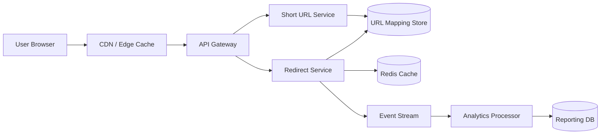
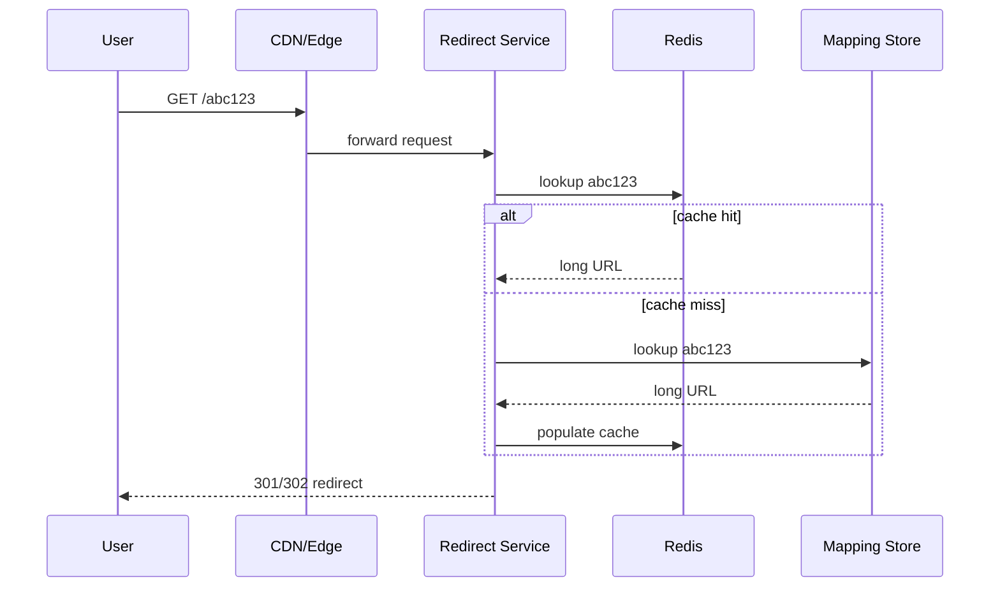

# URL Shortener System Design

This case study explains how to design a URL shortener that can create short links quickly, redirect users with very low latency, and survive massive read traffic.

## 1. Problem Statement

Users submit a long URL and receive a short code. Anyone who visits the short code should be redirected to the original destination with minimal delay.

At scale, the system must support billions of redirects, handle custom aliases, enforce expiration policies, and prevent collisions in generated IDs.

## 2. Functional Requirements

- Create a short URL for a long URL
- Redirect short codes to original URLs
- Support custom aliases when available
- Support link expiration
- Track basic analytics such as click count
- Prevent duplicate or colliding short codes
- Allow optional user ownership of links

## 3. Non-Functional Requirements

- Very low redirect latency
- High availability
- Horizontal scalability
- Collision-free code generation
- Durable storage for mappings
- Fast read path for redirects
- Abuse protection and rate limiting

## 4. Core APIs

```text
POST /urls
GET  /{code}
DELETE /urls/{code}
GET  /urls/{code}/stats
```

### Example Create Request

```json
{
  "longUrl": "https://example.com/articles/distributed-systems",
  "customAlias": "dist-sys",
  "expiresAt": "2026-12-31T00:00:00Z"
}
```

### Example Create Response

```json
{
  "shortUrl": "https://sho.rt/dist-sys",
  "code": "dist-sys",
  "longUrl": "https://example.com/articles/distributed-systems",
  "createdAt": "2026-06-06T00:00:00Z"
}
```

## 5. High-Level Design

```text
Create a complete system design diagram for "URL Shortener". Show create API path, code generation service, mapping store, redirect service, Redis cache, CDN edge, and async analytics pipeline. Mark cache hit/miss flow and 301/302 redirect decision points. Include scaling notes for high read traffic. Style: polished technical architecture visual, white background, blue/teal accents, 16:9.
```



### Main Idea

- The create path is write-heavy but low volume.
- The redirect path is read-heavy and must stay fast.
- Cache and CDN absorb most redirect traffic.
- The database remains the source of truth.

## 6. Code Generation Strategies

There are three common approaches:

### A. Auto-increment IDs + Base62 encoding

- Generate a unique numeric ID from a database sequence.
- Convert the number to Base62.
- Use the Base62 string as the code.

Pros:

- Simple
- Compact codes
- No collisions

Cons:

- Predictable IDs
- Requires coordination around ID generation

### B. Random strings

- Generate a random 6 to 8 character string.
- Check for collisions before storing.

Pros:

- Harder to guess
- Easy to distribute

Cons:

- Collision handling required
- More retries under heavy load

### C. Snowflake-style distributed IDs

- Generate time-ordered unique IDs across nodes.
- Convert to Base62 if needed.

Pros:

- Scales well
- No central bottleneck

Cons:

- More complex
- Needs clock safety and node coordination

## 7. Recommended Write Flow

1. Validate the long URL and optional alias.
2. Check for abuse and rate limits.
3. Generate a code.
4. Store the mapping in the database.
5. Cache the mapping for fast future redirects.
6. Return the short URL to the client.

## 8. Redirect Flow



The redirect service should return `301` for permanent redirects or `302` if you want the ability to change destinations later.

## 9. Data Model

```text
ShortUrl
- code (primary key)
- long_url
- user_id
- created_at
- expires_at
- is_custom_alias
- status
- click_count
- last_accessed_at
```

Suggested indexes:

- Primary key on `code`
- Secondary index on `user_id`
- Secondary index on `expires_at`

## 10. Cache Strategy

The redirect path should use cache-aside:

1. Look up the code in Redis.
2. If found, redirect immediately.
3. If not found, fetch from the database.
4. Store the result in Redis with a TTL.

Cache invalidation matters when URLs are deleted or updated. A delete should remove the DB row and evict the cache entry.

## 11. Analytics Design

Redirects should not block on analytics writes.

Recommended flow:

1. Redirect the user immediately.
2. Emit a click event to a stream.
3. Aggregate events asynchronously.
4. Store counters in a reporting system.

This keeps the user-facing latency low and avoids coupling redirects to analytics failures.

## 12. Abuse Prevention

- Rate limit URL creation per user or IP
- Block known malicious destinations
- Detect spam or phishing URLs
- Prevent brute-force enumeration of codes
- Add CAPTCHA for suspicious creation patterns

## 13. Trade-Offs

- Short codes that are human-friendly vs codes that are collision-resistant
- Permanent redirects vs mutable destinations
- Synchronous analytics vs low-latency redirects
- Centralized ID generation vs distributed generation
- Strict validation vs easier user experience

## 14. Failure Handling

- If Redis is down, fall back to the database.
- If the database is slow, serve cached redirects where possible.
- If code generation collides, retry with a new candidate.
- If analytics fails, do not block redirects.
- If an expired link is requested, return a clear 404 or 410.

## 15. Interview Summary

Use this framing in an interview:

1. Separate create and redirect paths.
2. Optimize redirects for reads and latency.
3. Use unique code generation with collision protection.
4. Add Redis and CDN for scale.
5. Keep analytics asynchronous.
6. Close with abuse control and expiration handling.

## 16. Optional Deep Dive Topics

- Base62 encoding math
- Distributed ID generation
- Multi-region redirect latency
- Custom alias reservation
- TTL-based cache invalidation
- 301 vs 302 semantics

---

This walkthrough is designed to be explained top-down in an interview, from product requirements through redirect optimization and failure recovery.
