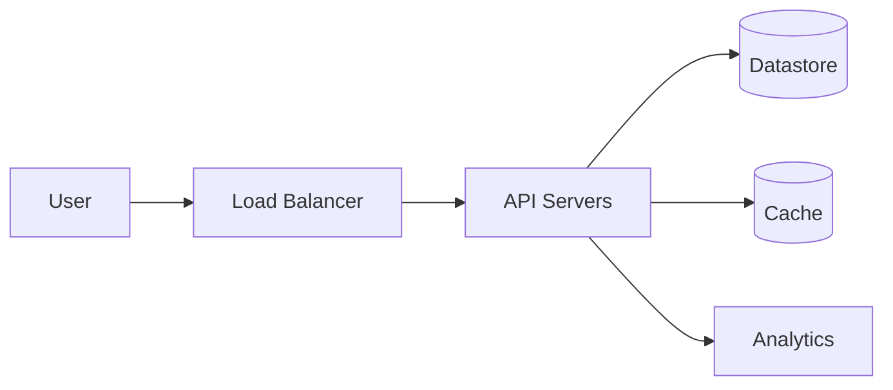

# Design URL Shortener

Design a URL shortening service like bit.ly.

## Requirements

- Shorten long URLs.
- Redirect short URLs to the original long URL.
- Support custom aliases when available.
- Provide high availability and low latency.
- Track basic analytics such as click count.
- Scale to billions of URLs.

## Estimation

- QPS: 50K
- Write: 100/s
- Read: 40K/s
- Storage: 100B URLs, average 100 bytes each.

## High Level Design

## Detailed Design

Separate the write path that creates codes from the read path that resolves redirects. Keep redirects fast with cache-aside and an asynchronously updated analytics pipeline.

## API Design

Expose create, redirect, delete, and stats endpoints. The redirect endpoint should stay minimal and avoid blocking on analytics writes.

## Data Model

Use the short code as the primary lookup key and maintain indexes for user ownership, expiration, and operational cleanup.

## Trade-offs

Discuss custom aliases, Base62 ID generation, collision handling, 301 vs 302 redirects, cache invalidation, and abuse prevention.

[Open the full solution](./)
