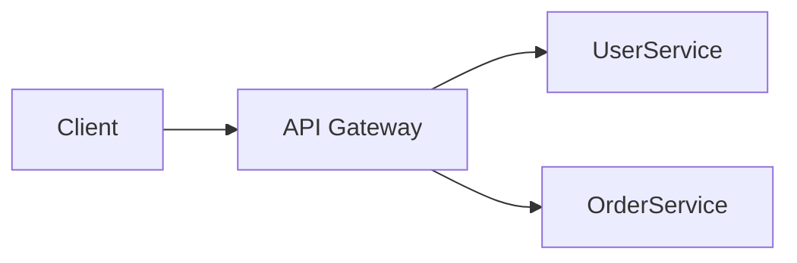

A single entry point that routes, authenticates, rate-limits, and transforms client requests before forwarding them to backend services.

When to use:
- Microservices architectures to present a unified API to clients.

Trade-offs:
- Can be a single point of failure or bottleneck; must be scaled and highly available.

Related: /50-system-design-patterns/

## Example
- Example: AWS API Gateway routes `/users/*` to the user service, applies auth and rate limits before forwarding.

## Diagram

