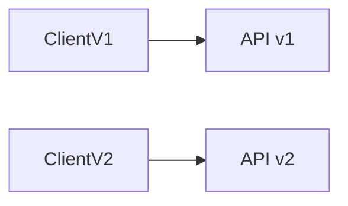

Support multiple API versions so existing clients continue working as the API evolves.

When to use:
- Public APIs or large internal ecosystems where consumers cannot upgrade quickly.

Trade-offs:
- Increased testing and maintenance burden across versions.

Related: /50-system-design-patterns/

## Example
- Example: Version APIs under `/v1/` and `/v2/` allowing older clients to continue using `/v1/` until they migrate.

## Diagram

