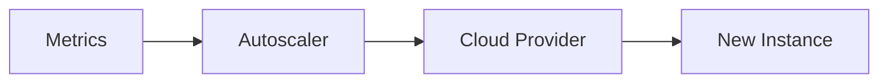

Automatically adjust instance counts based on metrics (CPU, request count, queue depth) to match demand.

When to use:
- Cloud workloads with variable traffic patterns (e-commerce, events).

Trade-offs:
- Provisioning takes time and requires careful metric selection to avoid oscillation or wasted cost.

Related: /50-system-design-patterns/

## Example
- Example: Auto-scale web servers based on request count per instance, adding instances when CPU > 70%.

## Diagram

