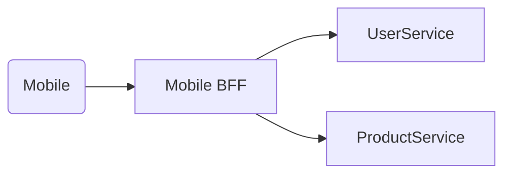

Provide tailored API layers for each client type (mobile, web) to optimize payloads and aggregation.

When to use:
- Different clients require distinct responses or performance characteristics.

Trade-offs:
- More layers to maintain and potential duplication of logic across BFFs.

Related: /50-system-design-patterns/

## Example
- Example: A mobile BFF aggregates multiple microservice calls into a single lightweight payload optimized for mobile networks.

## Diagram

