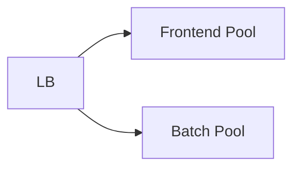

Isolate workloads into separate resource pools so one noisy workload cannot exhaust shared resources.

When to use:
- Multi-tenant systems or mixed workloads where isolation protects critical paths.

Trade-offs:
- Reserved pools can be underutilized, reducing overall efficiency.

Related: /50-system-design-patterns/

## Example
- Example: Separate thread pools and connection pools for user-facing requests and batch jobs so batch work cannot exhaust resources.

## Diagram

