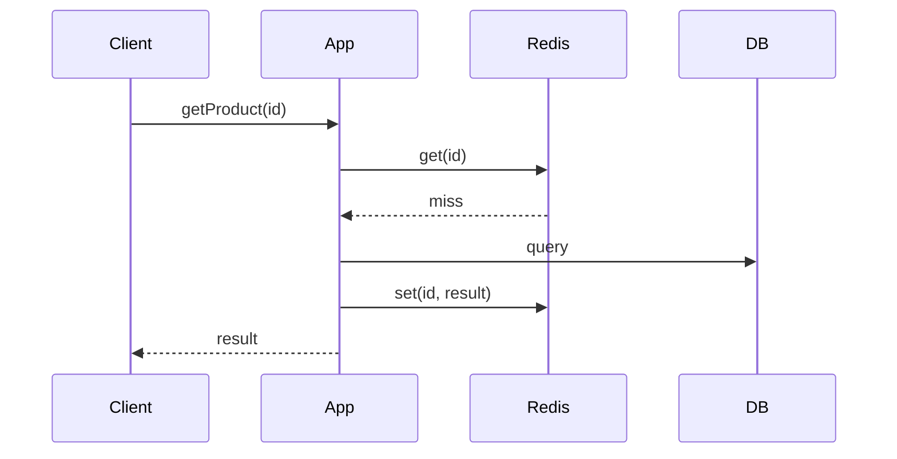

Application checks the cache first; on miss it reads from the DB, returns data, and populates the cache.

When to use:
- General caching for read-heavy access patterns where cache misses are tolerable.

Trade-offs:
- Cold-start misses and potential cache/DB inconsistency if writes bypass cache invalidation.

Related: /50-system-design-patterns/

## Example
- Example: Product detail requests check Redis first; on miss, the app queries PostgreSQL and caches the result.

## Diagram

