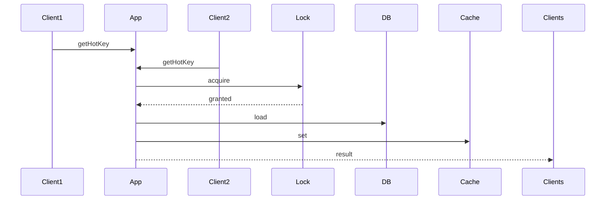

Prevent thousands of concurrent cache misses for the same key by coalescing requests, using locks, or probabilistic early refresh.

When to use:
- Popular entries that expire simultaneously (trending pages, hot profiles).

Trade-offs:
- Adds coordination complexity and potential hotspots if misconfigured.

Related: /50-system-design-patterns/

## Example
- Example: Use request coalescing where the first request regenerates a cache entry while other requests wait, or use randomized TTLs to stagger expirations.

## Diagram

