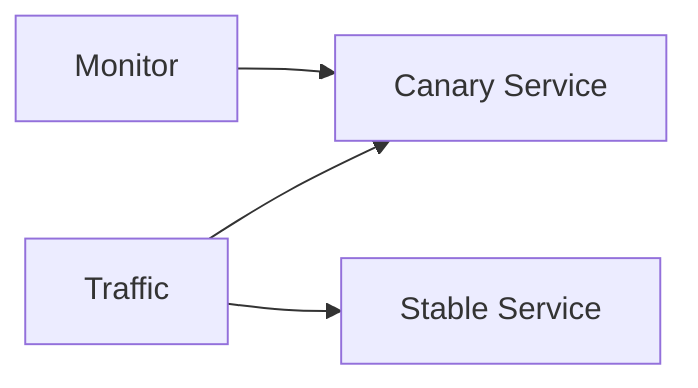

Roll out changes to a small subset of servers and route a small percentage of traffic to the canary while monitoring for regressions before full rollout.

When to use:
- Production deployments where catching issues with real traffic is valuable.

Trade-offs:
- Requires traffic routing infrastructure and parallel version compatibility; rollout adds time to release.

Related: /50-system-design-patterns/

## Example
- Example: Deploy a new version to 5% of servers and route a small subset of traffic to it while monitoring error rates.

## Diagram

