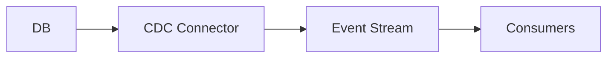

Emit database changes (inserts/updates/deletes) as a stream so downstream systems can react or replicate data.

When to use:
- Syncing search indexes, caches, or feeding data warehouses without batch ETL.

Trade-offs:
- Depends on DB capabilities; schema changes need careful handling downstream.

Related: /50-system-design-patterns/

## Example
- Example: Debezium reads MySQL binlogs and emits CDC events to Kafka to keep search indexes and caches in sync.

## Diagram

