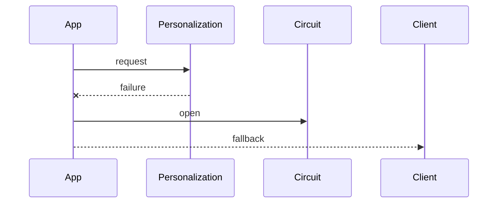

Stop calling repeatedly-failing dependencies and return a fallback until the dependency recovers.

When to use:
- To protect callers from cascading failures when downstream services degrade.

Trade-offs:
- Choosing thresholds and fallbacks requires careful tuning; fallbacks may be degraded.

Related: /50-system-design-patterns/

## Example
- Example: A recommendations service stops calling a slow personalization API and returns cached defaults until the API recovers.

## Diagram

