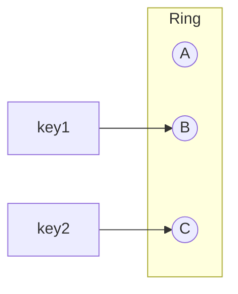

Place servers and keys on a hash ring so adding/removing nodes moves only nearby keys, minimizing reshuffling.

When to use:
- Distributed caches and storage where node membership frequently changes.

Trade-offs:
- More complex than simple modulo hashing; may require virtual nodes to avoid uneven distribution.

Related: /50-system-design-patterns/

## Example
- Example: A distributed cache where keys are placed on a hash ring; adding a cache node only reassigns nearby keys.

## Diagram

