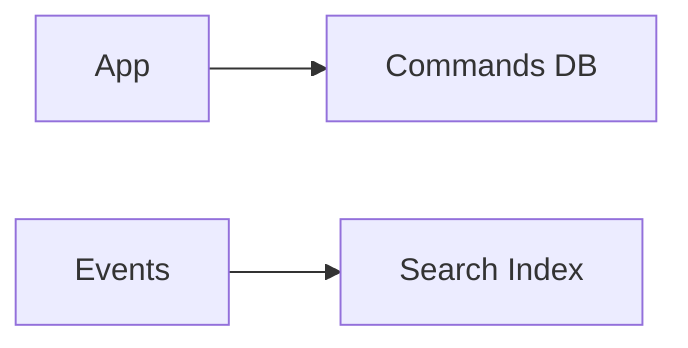

Separate write (commands) and read (queries) models so each can be optimized independently; often paired with event or projection systems.

When to use:
- Systems with divergent read and write performance or schema needs (e-commerce catalogs vs orders).

Trade-offs:
- Increased complexity and eventual consistency between models.

Related: /50-system-design-patterns/

## Example
- Example: Use a normalized relational DB for commands (orders) and a denormalized Elasticsearch index for product search queries.

## Diagram

