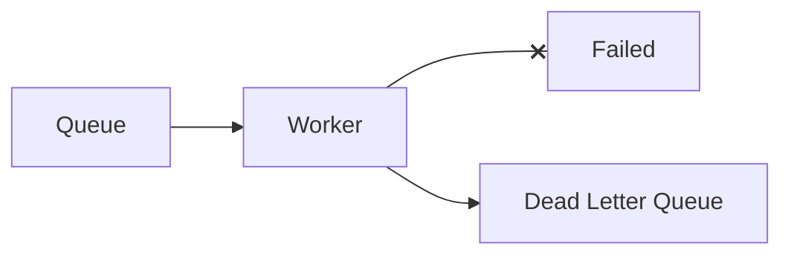

Send messages that repeatedly fail processing to a separate queue for inspection and replay.

When to use:
- Message-driven systems to prevent a single bad message from blocking the queue.

Trade-offs:
- Requires monitoring and remediation; DLQ can accumulate unless handled.

Related: /50-system-design-patterns/

## Example
- Example: Messages failing after N retries are moved to a `dead-letter` queue for manual inspection and replay.

## Diagram

