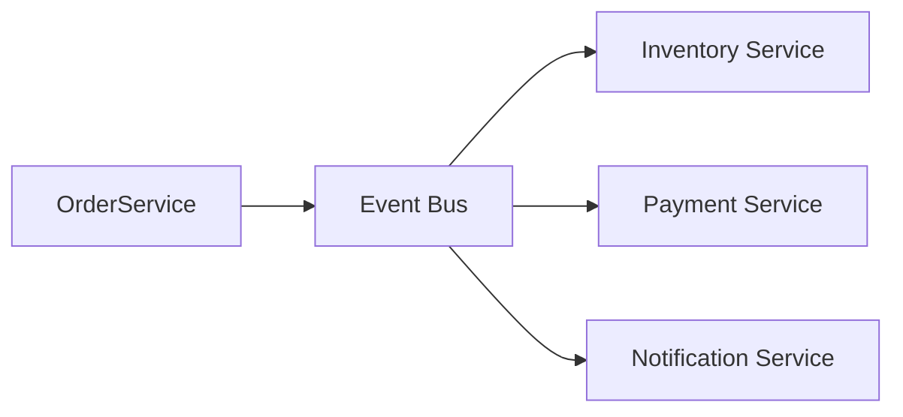

Services communicate by emitting and reacting to events instead of direct calls, enabling loose coupling.

When to use:
- Microservices that must evolve independently and react to shared domain events.

Trade-offs:
- Debugging distributed workflows is harder; end-to-end latency is less predictable.

Related: /50-system-design-patterns/

## Example
- Example: OrderPlaced events trigger inventory reservation, payment processing, and notification services, each subscribing to the event stream.

## Diagram

