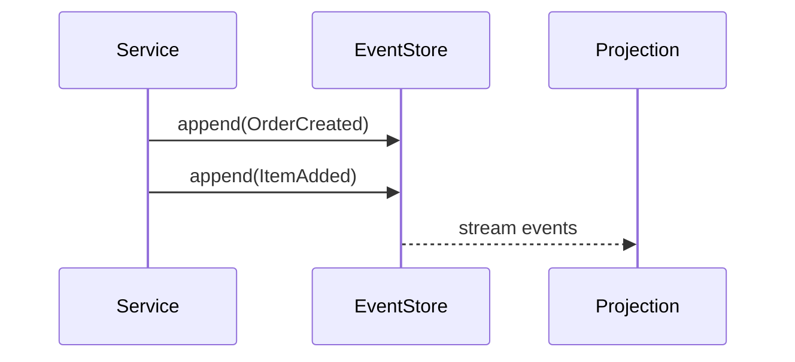

Persist every state change as an event; reconstruct current state by replaying the event stream.

When to use:
- Systems needing full audit trails, time-travel queries, or multiple read projections.

Trade-offs:
- Storage grows with events; schema evolution and querying current state require snapshots or projections.

Related: /50-system-design-patterns/

## Example
- Example: An order service stores events like OrderCreated, ItemAdded, PaymentReceived; the current order state is rebuilt by replaying events.

## Diagram

