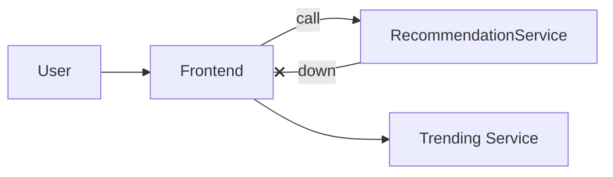

When non-critical components fail, continue serving a reduced experience instead of full outage.

When to use:
- User-facing systems where partial functionality preserves core value.

Trade-offs:
- Requires designing and testing degraded experiences; deciding critical vs optional features.

Related: /50-system-design-patterns/

## Example
- Example: When the recommendation service is down, show popular/trending items instead of personalized recommendations.

## Diagram

