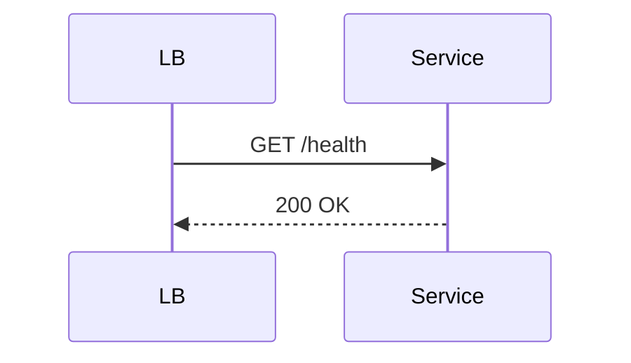

Expose liveness and readiness endpoints so orchestrators and load balancers can determine whether a service should receive traffic.

When to use:
- Every production service to enable safe restarts and routing.

Trade-offs:
- Deep checks can add latency and risk cascading check failures; shallow checks may miss dependency problems.

Related: /50-system-design-patterns/

## Example
- Example: A `/health` endpoint returns `200` when the app and DB are reachable; orchestrator probes readiness before routing traffic.

## Diagram

