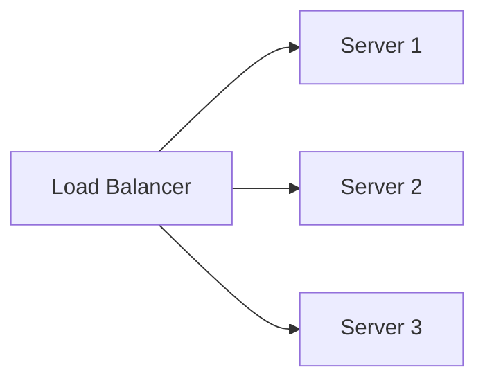

Add more machines to increase capacity; useful for stateless services where work parallelizes.

When to use:
- Web servers, API servers, and workers that can run in parallel.

Trade-offs:
- Needs load balancers and externalized state (sessions, caches).

Related: /50-system-design-patterns/

## Example
- Example: Run 10 identical web server instances behind an ELB; scale out to handle more traffic.

## Diagram

