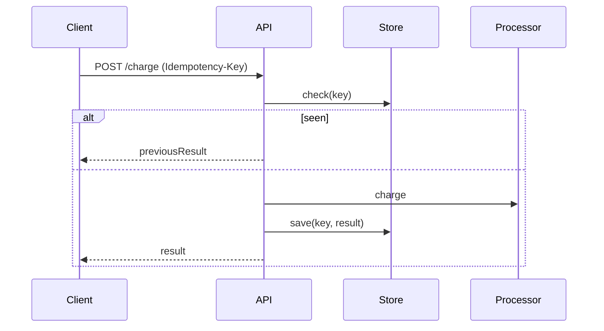

Design operations so that repeating them has the same effect as doing them once (use idempotency keys).

When to use:
- Any write API where clients may retry due to uncertainty.

Trade-offs:
- Requires tracking idempotency keys and extra lookups, adding complexity to writes.

Related: /50-system-design-patterns/

## Example
- Example: Payment APIs accept an `Idempotency-Key` so retries with the same key return the original result instead of charging twice.

## Diagram

