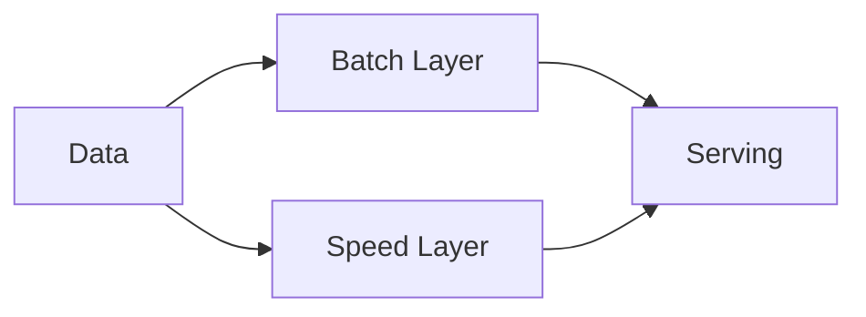

Combine a batch layer for accurate results and a stream layer for low-latency approximations, merging them in the serving layer.

When to use:
- Systems needing both correctness and freshness in analytics.

Trade-offs:
- Maintaining two pipelines doubles engineering effort and can duplicate logic.

Related: /50-system-design-patterns/

## Example
- Example: An analytics platform uses batch ETL for daily accuracy and a stream pipeline for live metrics, merged in the serving layer.

## Diagram

