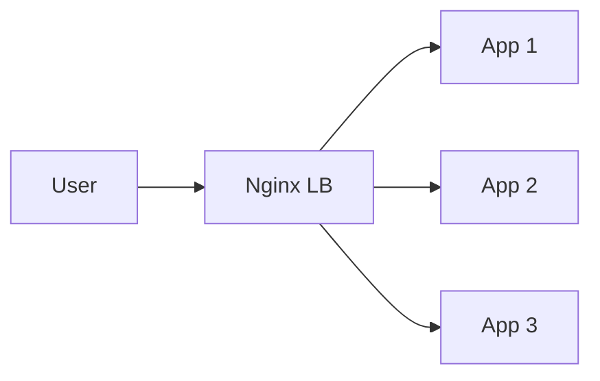

Distribute incoming requests across backend instances using algorithms like round-robin, least-connections, or ip-hash.

When to use:
- Any horizontally scaled service to distribute load and improve availability.

Trade-offs:
- Adds latency and can be a bottleneck if not highly available/scale-out.

Related: /50-system-design-patterns/

## Example
- Example: An Nginx load balancer routes HTTP requests across 4 backend app instances using least-connections.

## Diagram

