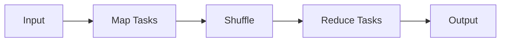

Split large batch jobs into map tasks that run in parallel and reduce tasks that aggregate results; designed for massive offline data processing.

When to use:
- ETL, large-scale analytics, and batch jobs that can tolerate high latency.

Trade-offs:
- High latency and resource overhead; not suitable for real-time needs.

Related: /50-system-design-patterns/

## Example
- Example: Hadoop MapReduce job that counts word frequencies across terabytes of logs in a nightly batch.

## Diagram

