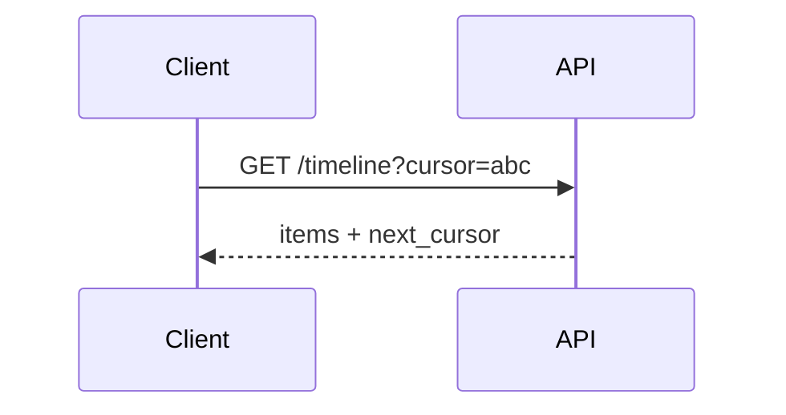

Return results in pages using an opaque cursor pointing to the last item; the client passes the cursor for the next page.

When to use:
- Large ordered result sets like timelines and activity feeds.

Trade-offs:
- Harder to jump to arbitrary pages compared to offset pagination.

Related: /50-system-design-patterns/

## Example
- Example: Timeline API returns `items` plus `next_cursor`; client requests subsequent pages with the cursor.

## Diagram

