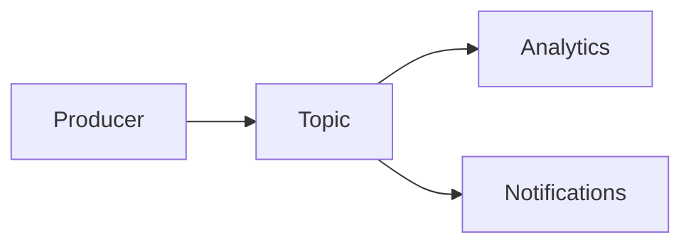

Publishers send messages to topics; multiple subscribers receive copies of each message.

When to use:
- Event broadcasting where multiple services react to the same event (analytics, notifications).

Trade-offs:
- Systems must handle duplicates and relaxed ordering guarantees.

Related: /50-system-design-patterns/

## Example
- Example: An analytics pipeline where events are published to a topic and multiple services (analytics, metrics, notifications) subscribe.

## Diagram

