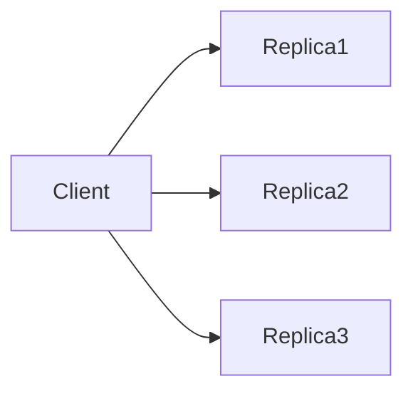

Require W write acknowledgements and R read acknowledgements such that W+R>N to guarantee reads see the latest write.

When to use:
- Tunable-consistency distributed stores (Dynamo-style systems) where trade-offs between latency and durability are adjustable.

Trade-offs:
- Higher W or R increases latency; tuning affects throughput and consistency.

Related: /50-system-design-patterns/

## Example
- Example: Dynamo-style writes require W=3 and reads require R=2 out of N=5 replicas to ensure reads see latest writes.

## Diagram

