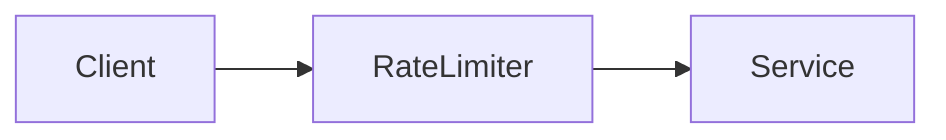

Throttle client requests using token bucket, fixed window, or sliding window algorithms to protect resources.

When to use:
- Public APIs and endpoints susceptible to abuse or bursts.

Trade-offs:
- Legitimate spikes may be throttled; the rate limiter must be performant to avoid adding latency.

Related: /50-system-design-patterns/

## Example
- Example: A token-bucket limiter allows bursts up to 100 requests and refills tokens at a steady rate.

## Diagram

