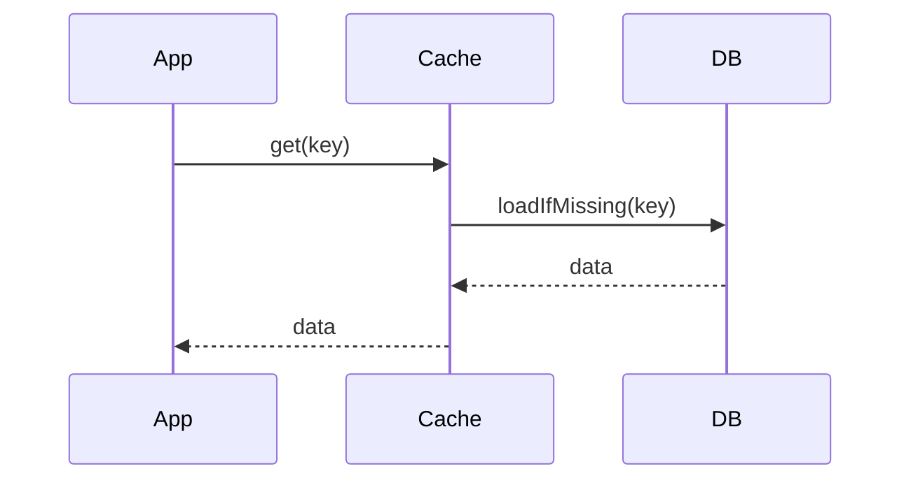

The cache loads from the backing store on a miss transparently; the application interacts only with the cache.

When to use:
- To centralize caching logic within infrastructure rather than application code.

Trade-offs:
- Tighter coupling between cache layer and data retrieval logic; less flexible than cache-aside.

Related: /50-system-design-patterns/

## Example
- Example: A managed cache layer (e.g., Redis module) loads from the DB on miss so the app code only queries the cache.

## Diagram

