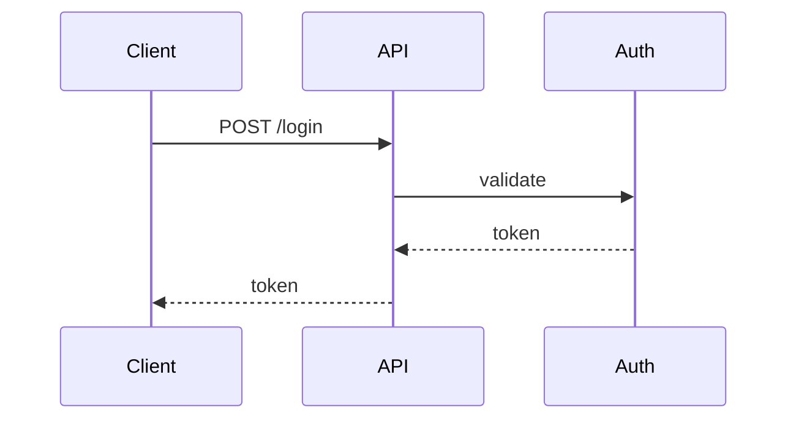

Client sends a request and waits for an immediate response, used by REST and unary gRPC calls.

When to use:
- User-facing APIs that require immediate answers (auth, data retrieval).

Trade-offs:
- Blocking callers and potential cascading latency across synchronous chains.

Related: /50-system-design-patterns/

## Example
- Example: A RESTful login endpoint where the client sends credentials and waits for an auth token.

## Diagram

