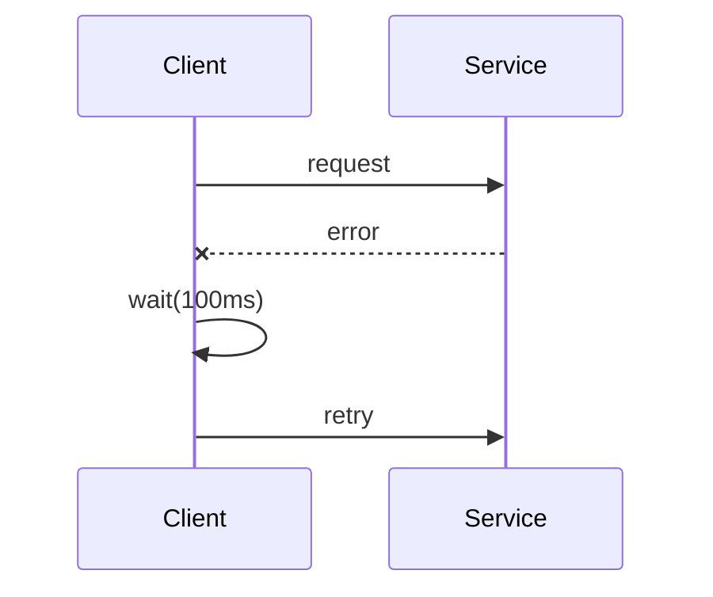

Retry failed requests with increasing delays and jitter to avoid synchronized retry storms.

When to use:
- Transient network errors or temporarily overloaded services.

Trade-offs:
- Retries can amplify load; must cap attempts and add jitter to avoid thundering herds.

Related: /50-system-design-patterns/

## Example
- Example: A client retrying a failed HTTP request with delays of 100ms, 200ms, 400ms and jitter until success or max attempts.

## Diagram

